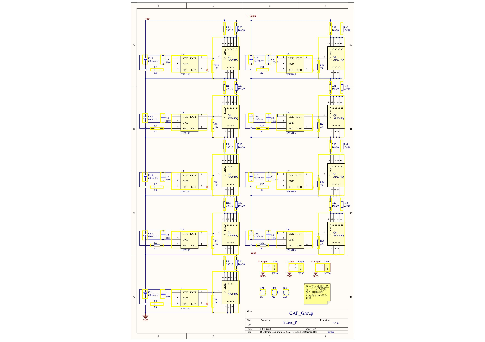
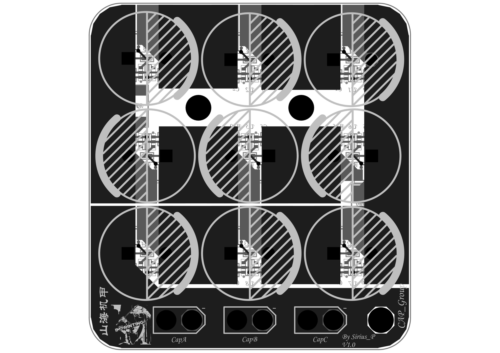
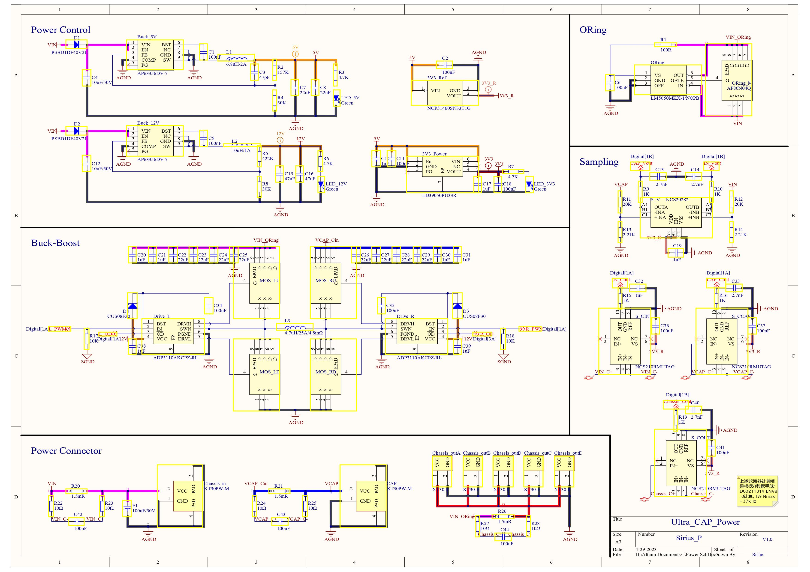
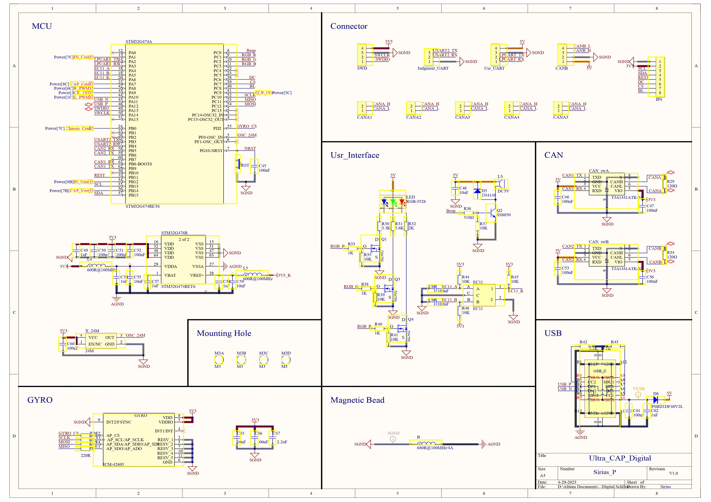
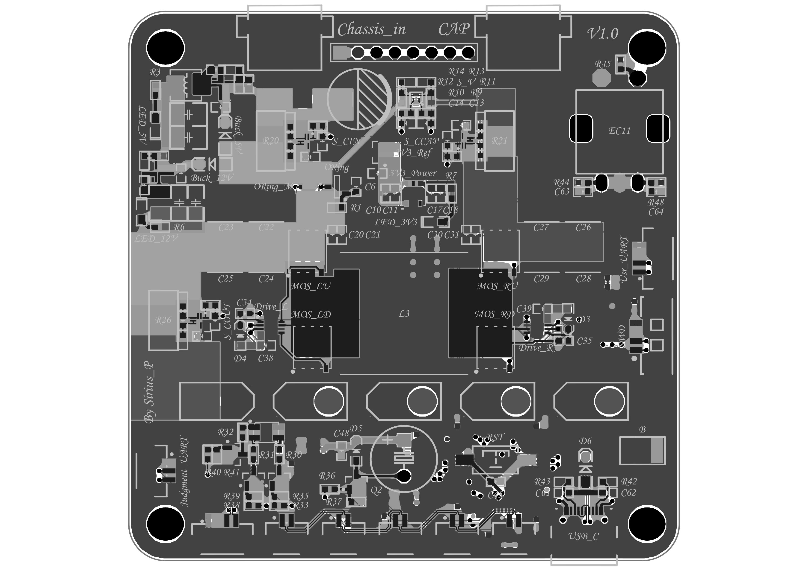

# SP_Ultra_CAP

### 目录内容

此文件夹用以存放Altium Designer工程文件

### 文件简介

GAP_Group：超级电容均衡板

Ultra_CAP_Ctrl：超级电容管理板

### 文件使用环境

Altium Designer23.4.1

### 文件使用方法

这个不用我多说吧，大家本职应该都是搞硬件的，看就完了，具体的设计说明请移步主目录中的Doc文件夹中的技术报告。

附图分别为两个工程的原理图&Layout图

GAP_Group：

Ultra_CAP_Ctrl：

